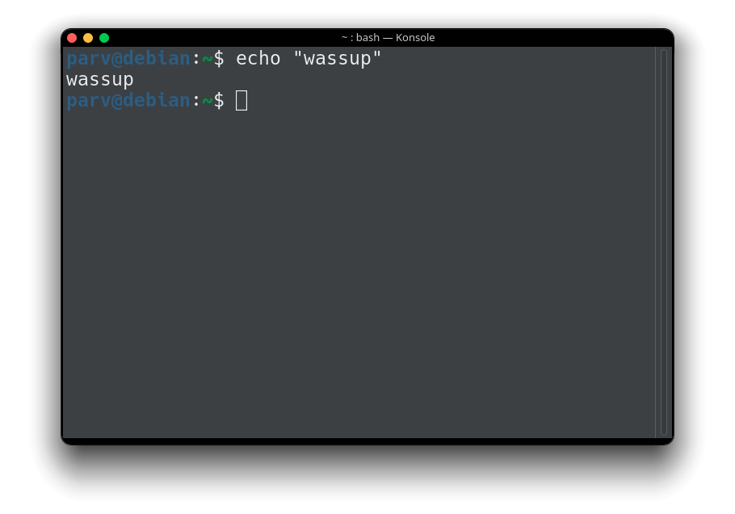

# AmoledMac Window Decoration for KDE Plasma

A simple, clean, and dark window decoration for KDE Plasma. Inspired by the minimalist aesthetic of macOS and designed with true-black elements to be easy on the eyes, especially on AMOLED/OLED screens.





---

## Features

- **macOS-style "traffic light"** window control buttons.
- **AMOLED-friendly dark title bar** that blends seamlessly into dark themes.
- Clean, subtle 1px border to define window edges.
- Minimalist design that stays out of your way.
- Clear visual distinction between active and inactive windows.

## Installation

### Using Git (Obviously)

This is the easiest way to install and stay up-to-date.

1.  Open a terminal.
2.  The theme needs to be in `~/.local/share/aurorae/themes/`. First, make sure the directory exists:
    ```bash
    mkdir -p ~/.local/share/aurorae/themes/
    ```
3.  Clone the repository directly into that directory:
    ```bash
    git clone https://github.com/parv141206/AmoledMac.git ~/.local/share/aurorae/themes/AmoledMac
    ```

## Activation

1.  Open **System Settings**.
2.  Navigate to **Appearance** > **Window Decorations**.
3.  You should see **"AmoledMac"** in the list of themes. Select it.
4.  Click **Apply** in the bottom right.

The changes should apply instantly. If you don't see the theme in the list after installing it, try logging out and logging back in to refresh KDE's theme cache.

## Feedback and Contributions

If you find any bugs, have suggestions for improvement, or would like to contribute, please feel free to open an issue or submit a pull request on this repository.

# Made with 🤍 by parv :)
